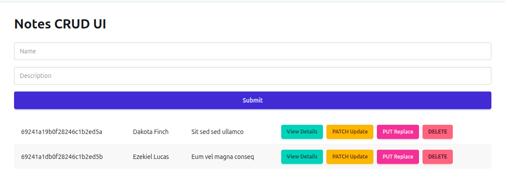

<h1 align="center">Express.js Notes</h1>

- [Express:](#express)
  - [Setup:](#setup)
  - [Routing:](#routing)
    - [Route parameters:](#route-parameters)
    - [Query Parameters:](#query-parameters)
  - [Middleware:](#middleware)
  - [Sending Response:](#sending-response)
  - [Router:](#router)
  - [Route chaining:](#route-chaining)
  - [Serving static files:](#serving-static-files)
- [Express + MongoDB:](#express--mongodb)
  - [setup:](#setup-1)
  - [Examples:](#examples)
    - [Example 1:](#example-1)
    - [Example 2:](#example-2)
- [Express + MongoDB + TS + Zod:](#express--mongodb--ts--zod)
  - [Example 1:](#example-1-1)
- [Express + PostgreSQL + TS:](#express--postgresql--ts)
  - [Example 1:](#example-1-2)
  - [Example 2:](#example-2-1)
  - [Example 3: Modular pattern server:](#example-3-modular-pattern-server)


# Express:
Express.js is a minimal, flexible and fast web framework for Node.js. It makes building APIs and web servers much easier than using the raw http module.

## Setup: 
```js
npm init -y
```
```js
npm install express
```

```js
const express = require("express");
const app = express();
const port = 3000;

// Home route
app.get("/", (req, res) => {
  res.send("Hello Express!");
});

// Start server
app.listen(port, () => {
  console.log(`Server running on http://localhost:${port}`);
});
```

## Routing:

```js
// GET request
app.get('/users', (req, res) => {
    res.send('Get all users');
});

// POST request
app.post('/users', (req, res) => {
    res.send('Create a new user');
});

// PUT request
app.put('/users/:id', (req, res) => {
    res.send(`Update user ${req.params.id}`);
});

// DELETE request
app.delete('/users/:id', (req, res) => {
    res.send(`Delete user ${req.params.id}`);
});
```

### Route parameters:
Access dynamic values form the url:

```js
app.get('/users/:id', (req, res) => {
    const userId = req.params.id;
    res.send(`User ID: ${userId}`);
});

// Multiple parameters
app.get('/posts/:year/:month', (req, res) => {
    res.json({
        year: req.params.year,
        month: req.params.month
    });
});
```

### Query Parameters: 
Access query strings from the URL:

```js
// URL: /search?term=express&limit=10
app.get('/search', (req, res) => {
    const term = req.query.term;
    const limit = req.query.limit;
    res.json({ term, limit });
});
```

## Middleware: 

Middleware is a function that runs between the request and the response. It have access to the request and response objects and can modify them or end the request-response cycle.

```js
const express = require('express');
const app = express();
const PORT = 3000;

// Built-in middleware for parsing JSON
app.use(express.json());


// application lavel middleware
app.use((req, res, next) => {
    console.log(`form custom middleware: ${req.method} ${req.url}`);
    next(); // Pass control to the next middleware
});

// route specific Middleware 
const authenticate = (req, res, next) => {
    const token = req.headers.authorization;
    if (token === 'secret-token') {
        next();
    } else {
        res.status(401).send('Unauthorized');
    }
};


app.get('/protected', authenticate, (req, res) => {
    res.send('This is protected content');
});

// Route that triggers an error
app.get('/error', (req, res, next) => {
    const err = new Error('Something went wrong!');
    next(err); // Pass error to error-handling middleware
});

// wildcard middleware (for unmatched routes)
app.use((req, res) => {
  res.status(404).send('Page not found');
});

// error handling middleware
// Use it to catch errors thrown in routes or middleware.
app.use((err, req, res, next) => {
  console.error(err.stack);
  res.status(500).json({ 
    message: 'Something went wrong!',
    error: err.message 
  });
});


// Start the server
app.listen(PORT, () => {
    console.log(`Server running on http://localhost:${PORT}`);
});
```

Note: When the client sends this:

```js
{
  "name": "Tamim",
  "age": 20
}
```

You can access it in Express like:

```js
req.body.name
req.body.age
```
Without express.json(), req.body will always be undefined.

## Sending Response: 
Express provides several ways to send responses:

```js
  res.send('Plain text response');
  
  // Send JSON
  res.json({ message: 'JSON response' });
  
  // Send with status code
  res.status(404).send('Not found');
  
  // Redirect
  res.redirect('/another-page');
  
  // Send file
  res.sendFile(__dirname + '/index.html');
```

## Router:
Organize routes using Express Router:

routes/users.js:
```js
const express = require('express');
const router = express.Router(); 

// GET /api/users
router.get('/', (req, res) => {
  res.send('Get all users');
});

// GET /api/users/:id
router.get('/:id', (req, res) => {
  res.send(`Get user ${req.params.id}`);
});

module.exports = router;
```

index.js: 
```js
const express = require('express');
const app = express();
const PORT = 3000;

// import the router
const userRoutes = require('./routes/users');

// mount the router with a prefix
app.use('/api/users', userRoutes);

app.listen(PORT, () => {
  console.log(`Server running on http://localhost:${PORT}`);
});
```

## Route chaining: 

```js
// Route chaining for /users
app.route('/users')
  .get((req, res) => {
    // GET /users - fetch all users
    res.send('Get all users');
  })
  .post((req, res) => {
    // POST /users - create a new user
    const newUser = req.body;
    res.send(`User created: ${JSON.stringify(newUser)}`);
  })
  .put((req, res) => {
    // PUT /users - update all users (just an example)
    res.send('Update all users');
  });

// Route chaining for /users/:id
app.route('/users/:id')
  .get((req, res) => {
    res.send(`Get user with ID ${req.params.id}`);
  })
  .put((req, res) => {
    res.send(`Update user with ID ${req.params.id}`);
  })
  .delete((req, res) => {
    res.send(`Delete user with ID ${req.params.id}`);
  });

app.listen(port, () => {
  console.log(`Server running on http://localhost:${port}`);
});
```

## Serving static files: 

Express provides a built-in middleware called express.static to serve static files like (html, css, js, images etc).

```js
public/
    ├── index.html
    └── images/
        └── logo.png

http://localhost:3000/index.html
http://localhost:3000/images/logo.png
```

```js
const express = require('express');
const path = require('path');

const app = express();
const port = 3000;

// Serve static files from "public" folder
app.use(express.static(path.join(__dirname, 'public')));

app.listen(port, () => {
    console.log(`Server running on http://localhost:${port}`);
});
```


# Express + MongoDB:

## setup:

**step 1:** 

```bash
npm init -y
```
**step 2:** 

```bash
npm i express mongodb nodemon cors dotenv
```

Note: 
- nodemon automatically restarts the server whenever we make code changes.
- cors allows cross-origin requests, useful when frontend and backend run on different ports or domains.
- dotenv lets us store sensitive data (like MongoDB URI or passwords) in a .env file and access them using process.env, keeping our project secure and preventing secrets from going to GitHub.

**step 3:** 

```js
const express = require('express')
const cors = require('cors')
require('dotenv').config()
const { MongoClient, ServerApiVersion, ObjectId } = require('mongodb');

const port = process.env.PORT || 3000

const app = express()
app.use(cors()) // use cors middleware
app.use(express.json()) // use express middleware


const client = new MongoClient(process.env.MONGODB_URI, {
    serverApi: {
        version: ServerApiVersion.v1,
        strict: true,
        deprecationErrors: true,
    }
});

async function run() {

    // const database = client.db("usersDB")
    // const usersCollection = database.collection('users')
    const usersCollection = client.db("usersDB").collection('users')


    /*
    
    ALl CRUD Operation here  
    
    */

    // Send a ping to confirm a successful connection
    await client.db("admin").command({ ping: 1 });
    console.log("Pinged your deployment. You successfully connected to MongoDB!");
}
run().catch(console.dir);


app.get('/', (req, res) => {
    res.send('Hello World!')
})

app.listen(port, () => {
    console.log(`Example app listening on port ${port}`)
})
```
Note: Middleware in Express is a function that runs between the request and the response. It can modify the request, check something, or run some logic before sending the final response.

**step 4:** 

- `"start": "node index.js"`: Many deployment platforms (like Render, Vercel, Railway, Heroku) automatically look for this script and They use this command to run your server., if we don't include it, deployment will fail because the platform doesn't know hot to start your app.

- `"dev": "nodemon index.js",`: here nodemon is not installed globally, so we can run it directly from the terminal using: `nodemon index.js`. thats why we set nodemon into the script and when we write `npm run dev` nodemon will works.

```js
{
  "name": "server",
  "version": "1.0.0",
  "description": "",
  "main": "index.js",
  "scripts": {
    "start": "node index.js",
    "dev": "nodemon index.js",
    "test": "echo \"Error: no test specified\" && exit 1"
  },
  "keywords": [],
  "author": "",
  "license": "ISC",
  "type": "commonjs",
  "dependencies": {
    "cors": "^2.8.5",
    "express": "^5.1.0",
    "mongodb": "^7.0.0",
    "nodemon": "^3.1.11"
  }
}
```


## Examples:

### Example 1:

Backend:

```js
const express = require('express')
const cors = require('cors')
const { MongoClient, ServerApiVersion, ObjectId } = require('mongodb');

const port = process.env.PORT || 3000

const app = express()
app.use(cors()) // use cors middleware
app.use(express.json()) // use express middleware


const uri = "Enter your mongodb uri";

const client = new MongoClient(uri, {
    serverApi: {
        version: ServerApiVersion.v1,
        strict: true,
        deprecationErrors: true,
    }
});

async function run() {

    const notesCollection = client.db("crudDB").collection('notes')


    // POST - create new note
    app.post('/notes', async (req, res) => {
        const note = req.body;
        const result = await notesCollection.insertOne(note);
        res.send(result);
    });


    // GET all notes
    app.get('/notes', async (req, res) => {
        const notes = await notesCollection.find({}).toArray();
        res.send(notes);
    });

    // GET a single note
    app.get('/notes/:id', async (req, res) => {
        const id = req.params.id
        const filter = { _id: new ObjectId(id) }
        const result = await notesCollection.findOne(filter);
        res.send(result);
    });


    // PATCH - partial update
    app.patch('/notes/:id', async (req, res) => {
        const id = req.params.id
        const filter = { _id: new ObjectId(id) }
        const updatedData = req.body;
        const updateDoc = {
            $set: {
                name: updatedData.name,
                description: updatedData.description
            }
        }

        const result = await notesCollection.updateOne(filter, updatedDoc);
        res.send(result);
    });

    // PUT - full replace
    app.put('/notes/:id', async (req, res) => {
        const id = req.params.id
        const filter = { _id: new ObjectId(id) }
        const updatedData = req.body;
        const options = { upsert: true }

        const result = await notesCollection.replaceOne(filter, updatedData, options);
        res.send(result);
    });


    // DELETE
    app.delete('/notes/:id', async (req, res) => {
        const result = await notesCollection.deleteOne({ _id: new ObjectId(req.params.id) });
        res.send(result);
    });


    await client.db("admin").command({ ping: 1 });
    console.log("Pinged your deployment. You successfully connected to MongoDB!");

}
run().catch(console.dir);


app.get('/', (req, res) => {
    res.send('Hello World!')
})

app.listen(port, () => {
    console.log(`Example app listening on port ${port}`)
})
```

Frontend V1 with fetch:

```jsx
import React, { useEffect, useState } from 'react';
import toast from 'react-hot-toast';
import { Description, Dialog, DialogPanel, DialogTitle } from '@headlessui/react'
import { Link } from 'react-router';

const App = () => {

  const [notes, setNotes] = useState()
  const [singleNotes, setSingleNotes] = useState(null)
  const [patchData, setPatchData] = useState(null)
  const [putData, setPutData] = useState(null)

  const [viewDetailsDialog, setViewDetailsDialog] = useState(false)
  const [patchDialog, setPatchDialog] = useState(false)
  const [putDialog, setPutDialog] = useState(false)
  const [id, setId] = useState()

  // send data to db
  const handleSubmit = (e) => {
    e.preventDefault();
    const name = e.target.name.value
    const description = e.target.description.value
    const singleNoteObj = { name, description }

    fetch('http://localhost:3000/notes',
      {
        method: "POST",
        headers: {
          'content-type': 'application/json'
        },
        body: JSON.stringify(singleNoteObj)
      })
      .then(res => res.json())
      .then(data => {
        if (data.insertedId) {
          toast.success("Note Added")
          e.target.reset()
          console.log(data)
          singleNoteObj._id = data.insertedId
          setNotes([...notes, singleNoteObj])
        }
      })
  }


  // get all data form db
  useEffect(() => {
    fetch('http://localhost:3000/notes')
      .then(res => res.json())
      .then(data => setNotes(data))
  }, [])


  // get single data form db
  useEffect(() => {
    if (!id) return
    fetch(`http://localhost:3000/notes/${id}`)
      .then(res => res.json())
      .then(data => setSingleNotes(data))
  }, [id])


  // update selected object partial data
  const handlePatchUpdate = (e) => {
    e.preventDefault();
    const name = e.target.name.value
    const description = e.target.description.value
    const patchObj = { name, description }

    fetch(`http://localhost:3000/notes/${id}`,
      {
        method: "PATCH",
        headers: {
          'content-type': 'application/json'
        },
        body: JSON.stringify(patchObj)
      })
      .then(res => res.json())
      .then(data => {
        if (data.modifiedCount) {
          toast.success("Note Updated(PATCH)")
          console.log(data)

          const updatedNotes = notes.map((note) => note._id === id ? { ...note, ...patchObj } : note)

          setNotes(updatedNotes)
          setPatchDialog(false)
        }
      })
  }


  // replace selected object full data
  const handlePutUpdate = (e) => {
    e.preventDefault();
    const name = e.target.name.value
    const description = e.target.description.value
    const putObj = { name, description }

    fetch(`http://localhost:3000/notes/${id}`,
      {
        method: "PUT",
        headers: {
          'content-type': 'application/json'
        },
        body: JSON.stringify(putObj)
      })
      .then(res => res.json())
      .then(data => {
        if (data.modifiedCount) {
          toast.success("Note Updated(PATCH)")
          console.log(data)

          const updatedNotes = notes.map((note) => note._id === id ? { ...note, ...putObj } : note)

          setNotes(updatedNotes)
          setPutDialog(false)
        }
      })
  }


  // delete data form db
  const handleDelete = (id) => {
    fetch(`http://localhost:3000/notes/${id}`, {
      method: "DELETE",
    })
      .then(res => res.json())
      .then(data => {
        if (data.deletedCount) {
          console.log(data)
          toast.success("Note Deleted")

          const remainingNotes = notes.filter((note) => note._id !== id)
          setNotes(remainingNotes)
        }
      })
  }
  return (
    <div className="p-8 max-w-6xl mx-auto">
      <h1 className="text-3xl font-bold mb-6">Notes CRUD UI</h1>

      {/* Form */}
      <form onSubmit={handleSubmit} className="mb-6 space-y-4">
        <input type="text" name="name" placeholder="Name" className="input w-full" />
        <input type="text" name="description" placeholder="Description" className="input w-full" />
        <input type="submit" value="Submit" className='btn w-full btn-primary' />
      </form>

      {/* Notes */}
      <div className="overflow-x-auto">
        <table className="table w-full table-zebra">
          <tbody>
            {notes?.map((note) => (
              <tr key={note._id}>
                <td>{note._id}</td>
                <td>{note.name}</td>
                <td>{note.description}</td>
                <td className="space-x-2">
                  {/* <Link to={`view-details/${note._id}`}><button className="btn btn-sm btn-accent">View Details</button></Link> */}
                  <button className="btn btn-sm btn-accent" onClick={() => {
                    setViewDetailsDialog(true)
                    setId(note._id)
                  }}>View Details</button>
                  <button className="btn btn-sm btn-warning" onClick={() => {
                    setPatchDialog(true)
                    setId(note._id)
                    setPatchData({ name: note.name, description: note.description })
                  }}>PATCH Update</button>
                  <button className="btn btn-sm btn-secondary" onClick={() => {
                    setPutDialog(true)
                    setId(note._id)
                    setPutData({ name: note.name, description: note.description })
                  }}>PUT Replace</button>
                  <button onClick={() => handleDelete(note._id)} className="btn btn-sm btn-error">DELETE</button>
                </td>
              </tr>
            ))}
          </tbody>
        </table>
      </div>

      {/* view details dialog */}
      <Dialog open={viewDetailsDialog} onClose={() => setViewDetailsDialog(false)} className="relative z-50">
        <div className="fixed inset-0 flex w-screen items-center justify-center p-4">
          <DialogPanel className="max-w-lg space-y-4 border bg-white p-12">
            <p>id: {singleNotes?._id}</p>
            <p>Name: {singleNotes?.name}</p>
            <p>Name: {singleNotes?.description}</p>
            <div className="flex gap-4">
              <button onClick={() => setViewDetailsDialog(false)} className='btn bg-error'>Cancel</button>
            </div>
          </DialogPanel>
        </div>
      </Dialog>

      {/* patch dialog */}
      <Dialog open={patchDialog} onClose={() => setPatchDialog(false)} className="relative z-50">
        <div className="fixed inset-0 flex w-screen items-center justify-center p-4">
          <DialogPanel className="max-w-lg space-y-4 border bg-white p-12">
            <DialogTitle className="font-bold">PATCH Update</DialogTitle>

            <form onSubmit={handlePatchUpdate} className="mb-6 space-y-4">
              <input type="text" name="name" value={patchData?.name} onChange={(e) => setPatchData({ ...patchData, name: e.target.value })} className="input w-full" />
              <input type="text" name="description" value={patchData?.description} onChange={(e) => setPatchData({ ...patchData, description: e.target.value })} className="input w-full" />
              <input type="submit" value="Submit" className='btn w-full btn-primary' />
            </form>
          </DialogPanel>
        </div>
      </Dialog>

      {/* put dialog */}
      <Dialog open={putDialog} onClose={() => setPutDialog(false)} className="relative z-50">
        <div className="fixed inset-0 flex w-screen items-center justify-center p-4">
          <DialogPanel className="max-w-lg space-y-4 border bg-white p-12">
            <DialogTitle className="font-bold">PUT Replace</DialogTitle>
            <form onSubmit={handlePutUpdate} className="mb-6 space-y-4">
              <input type="text" name="name" value={putData?.name} onChange={(e) => setPutData({ ...putData, name: e.target.value })} className="input w-full" />
              <input type="text" name="description" value={putData?.description} onChange={(e) => setPutData({ ...putData, description: e.target.value })} className="input w-full" />
              <input type="submit" value="Submit" className='btn w-full btn-primary' />
            </form>
          </DialogPanel>
        </div>
      </Dialog>
    </div>
  );
}

export default App;
```

Frontend V2 with axios:

```js
import React, { useEffect, useState } from 'react';
import toast from 'react-hot-toast';
import axios from 'axios';

const App = () => {

  const [notes, setNotes] = useState([])
  const [singleNotes, setSingleNotes] = useState(null) // or useState({})
  const [id, setId] = useState()

  // send data to db
  const handleSubmit = (e) => {
    e.preventDefault();
    const name = e.target.name.value
    const description = e.target.description.value
    const singleNoteObj = { name, description }

    axios.post('http://localhost:3000/notes', singleNoteObj)
      .then(data => {
        if (data.data.insertedId) {
          toast.success("Note Added")
          e.target.dataet()
          console.log(data.data)
          singleNoteObj._id = data.data.insertedId
          setNotes([...notes, singleNoteObj])
        }
      });
  }


  // get all data form db
  useEffect(() => {
    axios.get('http://localhost:3000/notes')
      .then(data => setNotes(data.data))
  }, [])


  // get single data form db
  useEffect(() => {
    if (!id) return;
    axios.get(`http://localhost:3000/notes/${id}`)
      .then(data => setSingleNotes(data.data))
  }, [id])


  // update selected object partial data
  const handlePatchUpdate = (e) => {
    e.preventDefault();
    const name = e.target.name.value
    const description = e.target.description.value
    const patchObj = { name, description }

    axios.patch(`http://localhost:3000/notes/${id}`, patchObj)
      .then(data => {
        if (data.data.modifiedCount) {
          toast.success("Note Updated(PATCH)")
          console.log(data.data)

          const updatedNotes = notes.map((note) => note._id === id ? { ...note, ...patchObj } : note)

          setNotes(updatedNotes)

          setSingleNotes(prev => ({ ...prev, ...patchObj }));
        }
      })
  }

  // replace selected object full data
  const handlePutUpdate = (e) => {
    e.preventDefault();
    const name = e.target.name.value
    const description = e.target.description.value
    const putObj = { name, description }

    axios.put(`http://localhost:3000/notes/${id}`, putObj)
      .then(data => {
        if (data.data.modifiedCount) {
          toast.success("Note Updated(PUT)")
          console.log(data.data)

          const updatedNotes = notes.map((note) => note._id === id ? { ...note, ...putObj } : note)

          setNotes(updatedNotes)

          setSingleNotes({ _id: id, ...putObj });
        }
      })
  }

  // delete data form db
  const handleDelete = (id) => {
    axios.delete(`http://localhost:3000/notes/${id}`)
      .then(data => {
        if (data.data.deletedCount) {
          console.log(data.data)
          toast.success("Note Deleted")

          const remainingNotes = notes.filter((note) => note._id !== id)
          setNotes(remainingNotes)
        }
      })
  }
  return (
    <div className="p-8 max-w-6xl mx-auto">
      <h1 className="text-3xl font-bold mb-6">Notes CRUD UI</h1>

      {/* Form */}
      <form onSubmit={handleSubmit} className="mb-6 space-y-4">
        <input type="text" name="name" placeholder="Name" className="input w-full" />
        <input type="text" name="description" placeholder="Description" className="input w-full" />
        <input type="submit" value="Submit" className='btn w-full btn-primary' />
      </form>

      {/* Notes */}
      <div className='space-y-4'>
        {notes?.map((note) => (
          <div key={note._id} className='flex items-center gap-2'>

            <p>{note._id}</p>
            <p>{note.name}</p>
            <p>{note.description}</p>

            <button className="btn" onClick={() => {
              document.getElementById('my_modal_1').showModal()
              setId(note._id)
            }}>View Details</button>

            <button className="btn" onClick={() => {
              document.getElementById('my_modal_2').showModal()
              setId(note._id)
            }}>PATCH Update</button>

            <button className="btn" onClick={() => {
              document.getElementById('my_modal_3').showModal()
              setId(note._id)
            }}>PUT Replace</button>

            <button className="btn" onClick={() => { handleDelete(note._id) }}>DELETE</button>

          </div>
        ))}
      </div>

      {/* view details modal */}
      <dialog id="my_modal_1" className="modal">
        <div className="modal-box">
          <p>id: {singleNotes?._id}</p>
          <p>Name: {singleNotes?.name}</p>
          <p>Name: {singleNotes?.description}</p>
        </div>
        <form method="dialog" className="modal-backdrop">
          <button>close</button>
        </form>
      </dialog>

      {/* patch modal */}
      <dialog id="my_modal_2" className="modal">
        <div className="modal-box">
          <form onSubmit={handlePatchUpdate} className="mb-6 space-y-4">
            <input type="text" name="name" defaultValue={singleNotes?.name} className="input w-full" />
            <input type="text" name="description" defaultValue={singleNotes?.description} className="input w-full" />
            <input type="submit" value="Submit" className='btn w-full btn-primary' />
          </form>
        </div>
        <form method="dialog" className="modal-backdrop">
          <button>close</button>
        </form>
      </dialog>

      {/* put modal */}
      <dialog id="my_modal_3" className="modal">
        <div className="modal-box">
          <form onSubmit={handlePutUpdate} className="mb-6 space-y-4">
            <input type="text" name="name" defaultValue={singleNotes?.name} className="input w-full" />
            <input type="text" name="description" defaultValue={singleNotes?.description} className="input w-full" />
            <input type="submit" value="Submit" className='btn w-full btn-primary' />
          </form>
        </div>
        <form method="dialog" className="modal-backdrop">
          <button>close</button>
        </form>
      </dialog>

    </div>
  );
}

export default App;
```



Frontend V3 with axios + tanstack query: 

```js
import React, { useState } from "react";
import toast from "react-hot-toast";
import axios from "axios";
import { useQuery, useMutation, useQueryClient } from "@tanstack/react-query";

function App() {
  const queryClient = useQueryClient();
  const [id, setId] = useState(null);

  // -----------------------------
  // Queries
  // -----------------------------

  // Get all notes
  // const {data: notes = [], ........} we can set default value of notes to empty array 
  // to avoid error before data loads, is optional because we used isLoading check below for this case
  const { data: notes, isLoading, isError, error } = useQuery({
    queryKey: ["notes"],
    queryFn: async () => {
      const data = await axios.get("http://localhost:3000/notes");
      return data.data;
    },
  });

  // Get single note
  const { data: singleNotes } = useQuery({
    queryKey: ["note", id],
    queryFn: async () => {
      const data = await axios.get(`http://localhost:3000/notes/${id}`);
      return data.data;
    },
    enabled: !!id, // only fetch if id exists
  });

  // -----------------------------
  // Mutations
  // -----------------------------

  // Create Note
  const createNoteMutation = useMutation({
    mutationFn: async (newNote) => axios.post("http://localhost:3000/notes", newNote),
    onSuccess: () => {
      toast.success("Note Added");
      queryClient.invalidateQueries(["notes"]); // refetch all notes
    },
  });

  // PATCH Note
  const patchNoteMutation = useMutation({
    mutationFn: async ({ id, patchObj }) =>
      axios.patch(`http://localhost:3000/notes/${id}`, patchObj),
    onSuccess: () => {
      toast.success("Note Updated (PATCH)");
      queryClient.invalidateQueries(["notes"]);
      queryClient.invalidateQueries(["note", id]);
    },
  });

  // PUT Note
  const putNoteMutation = useMutation({
    mutationFn: async ({ id, putObj }) =>
      axios.put(`http://localhost:3000/notes/${id}`, putObj),
    onSuccess: () => {
      toast.success("Note Updated (PUT)");
      queryClient.invalidateQueries(["notes"]);
      queryClient.invalidateQueries(["note", id]);
    },
  });

  // DELETE Note
  const deleteNoteMutation = useMutation({
    mutationFn: async (id) => axios.delete(`http://localhost:3000/notes/${id}`),
    onSuccess: () => {
      toast.success("Note Deleted");
      queryClient.invalidateQueries(["notes"]);
    },
  });

  // -----------------------------
  // Handlers
  // -----------------------------

  const handleSubmit = (e) => {
    e.preventDefault();
    const name = e.target.name.value;
    const description = e.target.description.value;
    createNoteMutation.mutate({ name, description });
    e.target.reset();
  };

  const handlePatchUpdate = (e) => {
    e.preventDefault();
    const patchObj = {
      name: e.target.name.value,
      description: e.target.description.value,
    };
    patchNoteMutation.mutate({ id, patchObj });
  };

  const handlePutUpdate = (e) => {
    e.preventDefault();
    const putObj = {
      name: e.target.name.value,
      description: e.target.description.value,
    };
    putNoteMutation.mutate({ id, putObj });
  };

  const handleDelete = (id) => {
    deleteNoteMutation.mutate(id);
  };

  if (isLoading) {
    return <h2 className="text-center text-5xl">Loading......</h2>;
  }

  if (isError) {
    return <h2 className="text-red-500">Error: {error.message}</h2>
  }

  return (
    <div className="p-8 max-w-6xl mx-auto">
      <h1 className="text-3xl font-bold mb-6">Notes CRUD UI (React Query)</h1>

      {/* Form */}
      <form onSubmit={handleSubmit} className="mb-6 space-y-4">
        <input type="text" name="name" placeholder="Name" className="input w-full" />
        <input
          type="text"
          name="description"
          placeholder="Description"
          className="input w-full"
        />
        <input type="submit" value="Submit" className="btn w-full btn-primary" />
      </form>

      {/* Notes List */}
      <div className="space-y-4">
        {notes.map((note) => (
          <div key={note._id} className="flex items-center gap-2">
            <p>{note._id}</p>
            <p>{note.name}</p>
            <p>{note.description}</p>

            <button
              className="btn"
              onClick={() => {
                setId(note._id);
                document.getElementById("my_modal_1").showModal();
              }}
            >
              View Details
            </button>

            <button
              className="btn"
              onClick={() => {
                setId(note._id);
                document.getElementById("my_modal_2").showModal();
              }}
            >
              PATCH Update
            </button>

            <button
              className="btn"
              onClick={() => {
                setId(note._id);
                document.getElementById("my_modal_3").showModal();
              }}
            >
              PUT Replace
            </button>

            <button className="btn" onClick={() => handleDelete(note._id)}>
              DELETE
            </button>
          </div>
        ))}
      </div>

      {/* View Modal */}
      <dialog id="my_modal_1" className="modal">
        <div className="modal-box">
          <p>id: {singleNotes?._id}</p>
          <p>Name: {singleNotes?.name}</p>
          <p>Description: {singleNotes?.description}</p>
        </div>
        <form method="dialog" className="modal-backdrop">
          <button>close</button>
        </form>
      </dialog>

      {/* PATCH Modal */}
      <dialog id="my_modal_2" className="modal">
        <div className="modal-box">
          <form onSubmit={handlePatchUpdate} className="mb-6 space-y-4">
            <input type="text" name="name" defaultValue={singleNotes?.name} className="input w-full" />
            <input type="text" name="description" defaultValue={singleNotes?.description} className="input w-full" />
            <input type="submit" value="Submit" className="btn w-full btn-primary" />
          </form>
        </div>
        <form method="dialog" className="modal-backdrop">
          <button>close</button>
        </form>
      </dialog>

      {/* PUT Modal */}
      <dialog id="my_modal_3" className="modal">
        <div className="modal-box">
          <form onSubmit={handlePutUpdate} className="mb-6 space-y-4">
            <input type="text" name="name" defaultValue={singleNotes?.name} className="input w-full" />
            <input type="text" name="description" defaultValue={singleNotes?.description} className="input w-full" />
            <input type="submit" value="Submit" className="btn w-full btn-primary" />
          </form>
        </div>
        <form method="dialog" className="modal-backdrop">
          <button>close</button>
        </form>
      </dialog>
    </div>
  );
}

export default App;
```

### Example 2:

Backend:

```js
const express = require('express')
const cors = require('cors')
const { MongoClient, ServerApiVersion, ObjectId } = require('mongodb');

const port = process.env.PORT || 3000

const app = express()
app.use(cors()) // use cors middleware
app.use(express.json()) // use express middleware


const uri = "mongodb://localhost:27017";

const client = new MongoClient(uri, {
    serverApi: {
        version: ServerApiVersion.v1,
        strict: true,
        deprecationErrors: true,
    },
});

async function run() {

    const usersCollection = client.db("userdb").collection('users')

    app.post('/users', async (req, res) => {
        const user = req.body;
        const result = await usersCollection.insertOne(user);
        res.send(result);
    });

    app.get('/users', async (req, res) => {
        const cursor = usersCollection.find()
        const result = await cursor.toArray()
        res.send(result)
    })

    app.get('/users/:id', async (req, res) => {
        const id = req.params.id
        const filter = { _id: new ObjectId(id) }
        const result = await usersCollection.findOne(filter)
        res.send(result)
    })

    app.Patch('/users/:id', async (req, res) => {
        const id = req.params.id
        const filter = { _id: new ObjectId(id) }
        const updatedData = req.body

        const updateDoc = {
            $set: {
                name: updatedData.name,
                email: updatedData.email
            }
        }

        const result = await usersCollection.updateOne(filter, updateDoc)
        res.send(result)
    })

    app.delete('/users/:id', async (req, res) => {
        const id = req.params.id
        const query = { _id: new ObjectId(id) }
        const result = await usersCollection.deleteOne(query)
        res.send(result)
    })

    // Send a ping to confirm a successful connection
    await client.db("admin").command({ ping: 1 });
    console.log("Pinged your deployment. You successfully connected to MongoDB!");
}
run().catch(console.dir);


app.get('/', (req, res) => {
    res.send('Hello World!')
})

app.listen(port, () => {
    console.log(`Example app listening on port ${port}`)
})
```

Frontend: 

```jsx
// main.jsx
import { StrictMode } from 'react'
import { createRoot } from 'react-dom/client';
import './index.css'
import { createBrowserRouter, RouterProvider } from 'react-router';
import MainLayout from './layout/MainLayout';
import App from './App';
import UserDetails from './components/UserDetails';
import UpdateUser from './components/UpdateUser';


const router = createBrowserRouter([
  {
    path: '/',
    Component: MainLayout,
    children: [
      {
        index: true,
        Component: App
      },
      {
        path: '/userDetails/:id',
        Component: UserDetails,
        loader: ({ params }) => fetch(`http://localhost:3000/users/${params.id}`),
        hydrateFallbackElement: <p>Loading..........</p>
      },
      {
        path: '/updateUser/:id',
        Component: UpdateUser,
        loader: ({ params }) => fetch(`http://localhost:3000/users/${params.id}`),
        hydrateFallbackElement: <p>Loading..........</p>
      },
    ]
  },
])

createRoot(document.getElementById('root')).render(
  <StrictMode>
    <RouterProvider router={router}></RouterProvider>
  </StrictMode>,
)
```

```jsx
import React from 'react';
import { Outlet } from 'react-router';

const MainLayout = () => {
    return (
        <div>
            <Outlet></Outlet>
        </div>
    );
};

export default MainLayout;
```

```jsx
import React from 'react';
import Users from './components/Users';

const usersPromise = fetch('http://localhost:3000/users').then(res => res.json())

const App = () => {
    return (
        <div>
            <Users usersPromise={usersPromise}></Users>
        </div>
    );
};

export default App;
```

```jsx
import React from 'react';
import { useState } from 'react';
import { use } from 'react';
import { Link } from 'react-router';

const Users = ({ usersPromise }) => {

    const initialUsers = use(usersPromise)
    const [users, setUsers] = useState(initialUsers)

    const handleSubmit = (e) => {
        e.preventDefault()
        const name = e.target.name.value
        const email = e.target.email.value
        const newUser = { name, email }

        fetch('http://localhost:3000/users', {
            method: "POST",
            headers: {
                'content-type': 'application/json'
            },
            body: JSON.stringify(newUser)
        })
            .then(res => res.json())
            .then(data => {
                if (data.insertedId) {
                    newUser._id = data.insertedId
                    const newUsers = [...users, newUser]
                    setUsers(newUsers)

                    alert("User Added Successfully")
                    console.log(data)
                    e.target.reset()
                }
            })
    }


    const handleDelete = (id) => {
        fetch(`http://localhost:3000/users/${id}`, {
            method: "DELETE",
        })
            .then(res => res.json())
            .then(data => {
                if (data.deletedCount) {
                    const remainingUsers = users.filter((user) => user._id !== id)
                    setUsers(remainingUsers)

                    alert("User deleted successfully")
                    console.log(data)
                }
            })
    }

    return (
        <div>
            <form onSubmit={handleSubmit}>
                <input type="text" name="name" className='input' /><br />
                <input type="email" name="email" className='input' /><br />
                <input type="submit" value="Summit" className='btn' />
            </form>

            {/* view users */}
            <div>
                {users.map((user) =>
                    <p key={user._id}>
                        {user.name} | {user.email}
                        <button onClick={() => handleDelete(user._id)} className='btn btn-xs'>X</button>
                        <Link to={`/userDetails/${user._id}`} className='btn btn-xs'>Details</Link>
                        <Link to={`/updateUser/${user._id}`} className='btn btn-xs'>Update</Link>
                    </p>
                )}
            </div>
        </div>
    );
};

export default Users;
```

```jsx
import React from 'react';
import { useLoaderData } from 'react-router';

const UserDetails = () => {
    const user = useLoaderData()
    console.log(user)
    return (
        <div>
            <p>{user.name}</p>
            <p>{user.email}</p>
        </div>
    );
};

export default UserDetails;
```

```jsx
import React from 'react';
import { useLoaderData } from 'react-router';

const UpdateUser = () => {
    const user = useLoaderData()

    const handleUpdate = e => {
        e.preventDefault()
        const name = e.target.name.value
        const email = e.target.email.value
        const updatedUser = { name, email }

        fetch(`http://localhost:3000/users/${user._id}`, {
            method: "PUT",
            headers: {
                'content-type': 'application/json'
            },
            body: JSON.stringify(updatedUser)
        })
            .then(res => res.json())
            .then(data => {
                if (data.modifiedCount) {
                    alert("User updated Successfully")
                    console.log(data)
                }
            })

    }

    return (
        <form onSubmit={handleUpdate}>
            <input type="text" name="name" className='input' defaultValue={user.name} /><br />
            <input type="email" name="email" className='input' defaultValue={user.email} /><br />
            <input type="submit" value="Summit" className='btn' />
        </form>
    );
};

export default UpdateUser;
```


# Express + MongoDB + TS + Zod:

## Example 1: 

[Click here to see the project](./express-mongodb-ts-zod-1)

# Express + PostgreSQL + TS:

## Example 1:

**Setup:**

```js
npm init -y
npm i express pg dotenv
npm i -D typescript tsx
npm i --save-dev @types/express @types/pg
tsc --init
```

```js
// tsconfig.json
{
  // Visit https://aka.ms/tsconfig to read more about this file
  "compilerOptions": {
    // File Layout
    "rootDir": "./src",
    "outDir": "./dist",
    // Environment Settings
    // See also https://aka.ms/tsconfig/module
    "module": "nodenext",
    "target": "esnext",
    "types": [],
    // For nodejs:
    // "lib": ["esnext"],
    // "types": ["node"],
    // and npm install -D @types/node
    // Other Outputs
    // "sourceMap": true,
    // "declaration": true,
    // "declarationMap": true,
    // Stricter Typechecking Options
    "noUncheckedIndexedAccess": true,
    "exactOptionalPropertyTypes": true,
    // Style Options
    // "noImplicitReturns": true,
    // "noImplicitOverride": true,
    // "noUnusedLocals": true,
    // "noUnusedParameters": true,
    // "noFallthroughCasesInSwitch": true,
    // "noPropertyAccessFromIndexSignature": true,
    // Recommended Options
    "strict": true,
    // "jsx": "react-jsx",
    // "verbatimModuleSyntax": true,
    "isolatedModules": true,
    "noUncheckedSideEffectImports": true,
    "moduleDetection": "force",
    "skipLibCheck": true,
  }
}
```

```js
// package.json
{
  "name": "module-12",
  "version": "1.0.0",
  "description": "",
  "main": "index.js",
  "scripts": {
    "dev": "npx tsx watch ./src/server.ts",
    "test": "echo \"Error: no test specified\" && exit 1"
  },
  "keywords": [],
  "author": "",
  "license": "ISC",
  "type": "module",
  "dependencies": {
    "dotenv": "^17.2.3",
    "express": "^5.2.1",
    "pg": "^8.16.3"
  },
  "devDependencies": {
    "@types/express": "^5.0.6",
    "@types/pg": "^8.15.6",
    "tsx": "^4.21.0",
    "typescript": "^5.9.3"
  }
}
```

```js
import express, { Request, Response } from "express";
import { Pool } from "pg";
import dotenv from "dotenv"
import path from "path"

const app = express();
app.use(express.json());

const port = process.env.PORT || 3000;
dotenv.config({ path: path.join(process.cwd(), ".env") })
const pool = new Pool({ connectionString: `${process.env.CONNECTION_STR}` });

const initDB = async () => {
    await pool.query(`
        CREATE TABLE IF NOT EXISTS notes (
        // your query
        )`)
}
initDB()

app.get("/", (req: Request, res: Response) => {
    res.send("PostgreSQL + TypeScript API is running!");
});

app.use((req: Request, res: Response) => {
    res.status(404).json({
        error: "Route not found",
        path: req.path,
    });
});


app.listen(port, () => {
    console.log(`Server running on port ${port}`);
});
```

Server:

```js
import express, { Request, Response } from "express";
import { Pool } from "pg";
import dotenv from "dotenv"
import path from "path"

const app = express();
app.use(express.json());

const port = process.env.PORT || 3000;
dotenv.config({ path: path.join(process.cwd(), ".env") })
const pool = new Pool({ connectionString: `${process.env.CONNECTION_STR}` });


const initDB = async () => {
    await pool.query(`
    CREATE TABLE IF NOT EXISTS notes (
    id SERIAL PRIMARY KEY,
    title TEXT NOT NULL,
    content TEXT NOT NULL,
    created_at TIMESTAMP DEFAULT NOW()
)`)
}
initDB()

// CREATE note
app.post("/notes", async (req: Request, res: Response) => {
    try {
        const { title, content } = req.body;
        const result = await pool.query("INSERT INTO notes (title, content) VALUES($1, $2) RETURNING *", [title, content]);
        res.send(result.rows);
    } catch (error) {
        res.status(500).send({ error });
    }
});

// GET all notes
app.get("/notes", async (req: Request, res: Response) => {
    try {
        const result = await pool.query("SELECT * FROM notes ORDER BY id DESC");
        res.json(result.rows);
    } catch (error) {
        res.status(500).send({ error });
    }
});

// GET single note
app.get("/notes/:id", async (req: Request, res: Response) => {
    try {
        const id = req.params.id;
        const result = await pool.query("SELECT * FROM notes WHERE id = $1", [id]);
        res.json(result.rows[0]);
    } catch (error) {
        res.status(500).send({ error });
    }
});

// PATCH note
app.patch("/notes/:id", async (req: Request, res: Response) => {
    try {
        const id = req.params.id;
        const { title, content } = req.body;
        const result = await pool.query(
            "UPDATE notes SET title = COALESCE($1, title), content=COALESCE($2, content) WHERE id=$3 RETURNING *",
            [title, content, id]
        );
        res.json(result.rows[0]);
    } catch (error) {
        res.status(500).json({ error });
    }
});

// PUT note
app.put("/notes/:id", async (req: Request, res: Response) => {
    try {
        const id = req.params.id;
        const { title, content } = req.body;
        const result = await pool.query("UPDATE notes SET title=$1, content=$2 WHERE id = $3 RETURNING *", [title, content,id]);
        res.json(result.rows[0]);
    } catch (error) {
        res.status(500).send({ error });
    }
});

// DELETE note
app.delete("/notes/:id", async (req: Request, res: Response) => {
    try {
        const id = req.params.id;
        await pool.query("DELETE FROM notes WHERE id = $1", [id]);
        res.json({ message: "Note deleted" });
    } catch (error) {
        res.status(500).send({ error });
    }
});


app.get("/", (req: Request, res: Response) => {
    res.send("PostgreSQL + TypeScript API is running!");
});

app.use((req: Request, res: Response) => {
    res.status(404).json({
        error: "Route not found",
        path: req.path,
    });
});


app.listen(port, () => {
    console.log(`Server running on port ${port}`);
});
```

## Example 2: 

```js
import express, { Request, Response } from "express";
import { Pool } from "pg";
import dotenv from "dotenv"
import path from "path"

const app = express();
app.use(express.json());

const port = process.env.PORT || 3000;
dotenv.config({ path: path.join(process.cwd(), ".env") })
const pool = new Pool({ connectionString: `${process.env.CONNECTION_STR}` });


const initDB = async () => {
    await pool.query(`
        CREATE TABLE IF NOT EXISTS users(
        id SERIAL PRIMARY KEY,
        name VARCHAR(100) NOT NULL,
        email VARCHAR(150) UNIQUE NOT NULL,
        password TEXT NOT NULL,
        age INT,
        phone VARCHAR(15),
        address TEXT,
        created_at TIMESTAMP DEFAULT NOW(),
        updated_at TIMESTAMP DEFAULT NOW()
        )`)
    await pool.query(`
        CREATE TABLE IF NOT EXISTS todos(
        id SERIAL PRIMARY KEY,
        user_id INT REFERENCES users(id) ON DELETE CASCADE,
        title VARCHAR(200) NOT NULL,
        description TEXT,
        completed BOOLEAN DEFAULT false
        )`)
}
initDB()


app.post("/users", async (req: Request, res: Response) => {
    try {
        const { name, email, password } = req.body
        const result = await pool.query("INSERT INTO users(name, email, password) VALUES($1, $2, $3) RETURNING *",
            [name, email, password])
        res.send(result.rows)
    }
    catch (err: any) {
        res.status(500).send({ message: err.message })
    }
})

app.get("/users", async (req: Request, res: Response) => {
    try {
        const result = await pool.query("SELECT * FROM users")
        res.send(result.rows)
    }
    catch (err: any) {
        res.status(500).send({ message: err.message })
    }
})

app.get("/users/:id", async (req: Request, res: Response) => {
    try {
        const id = req.params.id
        const result = await pool.query("SELECT * FROM users WHERE id=$1", [id])
        res.send(result.rows[0])
    }
    catch (err: any) {
        res.status(500).send({ message: err.message })
    }
})

app.put("/users/:id", async (req: Request, res: Response) => {
    try {
        const id = req.params.id
        const { name, email, password } = req.body
        const result = await pool.query("UPDATE users SET name=$1, email=$2, password=$3 WHERE id=$4 RETURNING *",
            [name, email, password, id])
        res.send(result.rows[0])
    }
    catch (err: any) {
        res.status(500).send({ message: err.message })
    }
})

app.delete("/users/:id", async (req: Request, res: Response) => {
    try {
        const id = req.params.id

        const result = await pool.query("DELETE FROM users WHERE id=$1", [id])
        res.send({ message: "User deleted" })
    }
    catch (err: any) {
        res.status(500).send({ message: err.message })
    }
})


app.post("/todos", async (req: Request, res: Response) => {
    try {
        const { user_id, title } = req.body
        const result = await pool.query("INSERT INTO todos(user_id, title) VALUES($1, $2) RETURNING *", [user_id, title])
        res.send(result.rows)
    }
    catch (err: any) {
        res.status(500).send({ message: err.message })
    }
})

app.get("/todos", async (req: Request, res: Response) => {
    try {
        const result = await pool.query("SELECT * FROM todos")
        res.send(result.rows)
    }
    catch (err: any) {
        res.status(500).send({ message: err.message })
    }
})

app.get("/todos/:id", async (req: Request, res: Response) => {
    try {
        const id = req.params.id
        const result = await pool.query("SELECT * FROM todos WHERE id=$1", [id])
        res.send(result.rows[0])
    }
    catch (err: any) {
        res.status(500).send({ message: err.message })
    }
})

app.put("/todos/:id", async (req: Request, res: Response) => {
    try {
        const id = req.params.id
        const { title } = req.body
        const result = await pool.query("UPDATE todos SET title=$1 WHERE id=$2 RETURNING *", [title, id])
        res.send(result.rows[0])
    }
    catch (err: any) {
        res.status(500).send({ message: err.message })
    }
})

app.delete("/todos/:id", async (req: Request, res: Response) => {
    try {
        const id = req.params.id
        const result = await pool.query("DELETE FROM todos WHERE id=$1", [id])
        res.send({ message: "todos deleted" })
    }
    catch (err: any) {
        res.status(500).send({ message: err.message })
    }
})


app.use((req: Request, res: Response) => {
    res.status(404).json({
        error: "Route Not Found",
        path: req.path
    })
})

// Home route
app.get("/", (req: Request, res: Response) => {
    res.send("Hello Express!");
});

// Start server
app.listen(port, () => {
    console.log(`Server running on http://localhost:${port}`);
});
```

## Example 3: Modular pattern server: 

**Setup:**

```js
npm init -y
npm i express pg dotenv bcryptjs jsonwebtoken
npm i -D typescript tsx
npm i --save-dev @types/express @types/pg @types/jsonwebtoken
tsc --init
```

```js
// tsconfig.json
{
  // Visit https://aka.ms/tsconfig to read more about this file
  "compilerOptions": {
    // File Layout
    "rootDir": "./src",
    "outDir": "./dist",
    // Environment Settings
    // See also https://aka.ms/tsconfig/module
    "module": "nodenext",
    "target": "esnext",
    "types": [],
    // For nodejs:
    // "lib": ["esnext"],
    // "types": ["node"],
    // and npm install -D @types/node
    // Other Outputs
    "sourceMap": true,
    "declaration": true,
    "declarationMap": true,
    // Stricter Typechecking Options
    "noUncheckedIndexedAccess": true,
    "exactOptionalPropertyTypes": true,
    // Style Options
    "noImplicitReturns": true,
    "noImplicitOverride": true,
    // "noUnusedLocals": true,
    // "noUnusedParameters": true,
    // "noFallthroughCasesInSwitch": true,
    // "noPropertyAccessFromIndexSignature": true,
    // Recommended Options
    "strict": true,
    // "jsx": "react-jsx",
    // "verbatimModuleSyntax": true,
    "isolatedModules": true,
    "noUncheckedSideEffectImports": true,
    "moduleDetection": "force",
    "skipLibCheck": true,
  }
}
```

```js
// package.json
{
  "name": "module-12",
  "version": "1.0.0",
  "description": "",
  "main": "index.js",
  "scripts": {
    "dev": "npx tsx watch ./src/server.ts",
    "test": "echo \"Error: no test specified\" && exit 1"
  },
  "keywords": [],
  "author": "",
  "license": "ISC",
  "type": "module",
  "dependencies": {
    "bcryptjs": "^3.0.3",
    "dotenv": "^17.2.3",
    "express": "^5.2.1",
    "jsonwebtoken": "^9.0.3",
    "pg": "^8.16.3"
  },
  "devDependencies": {
    "@types/express": "^5.0.6",
    "@types/jsonwebtoken": "^9.0.10",
    "@types/pg": "^8.15.6",
    "tsx": "^4.21.0",
    "typescript": "^5.9.3"
  }
}
```

**Server:**

[Click here to see the code](./express-postgresql-ts-1/)
